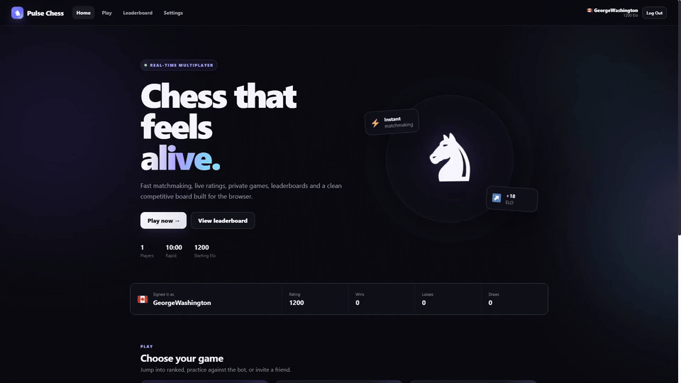
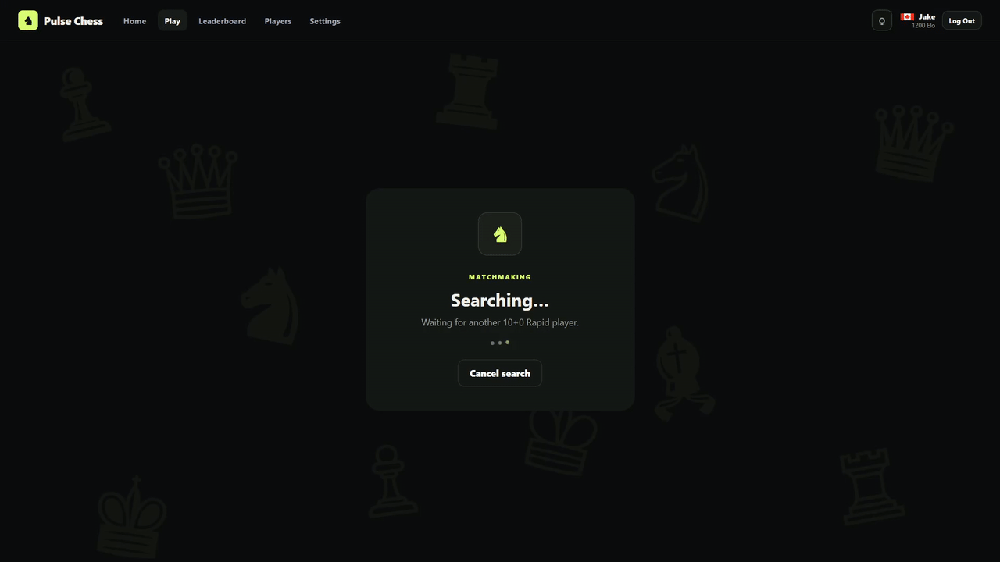
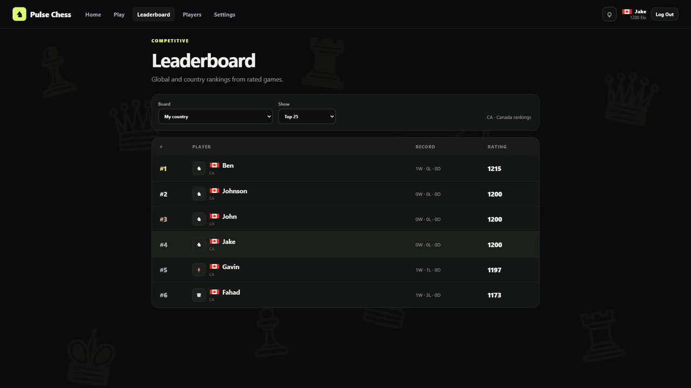
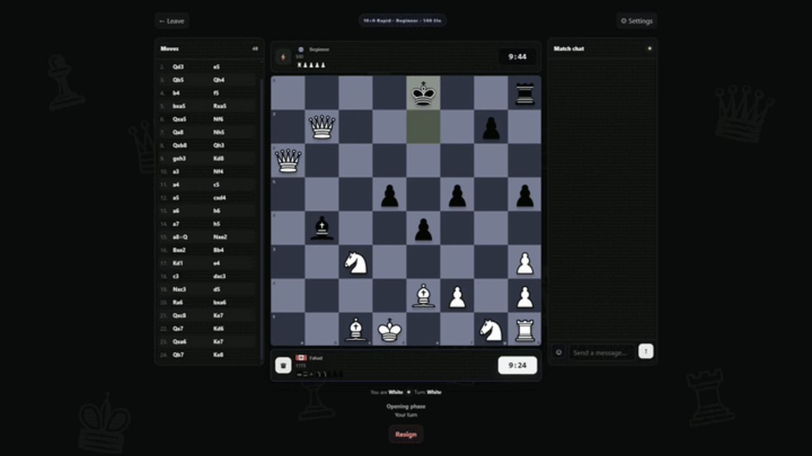

# Pulse Chess

Pulse Chess is a real-time browser chess platform built with vanilla JavaScript, Node.js, Express, Socket.IO, PostgreSQL, chess.js, and Stockfish 18.

## Demo

The final interface is designed around a clean, dark chess experience:

### Home



### Matchmaking



### Leaderboards



### Game result



These animations are included in `assets/demo/` so GitHub renders them directly in the repository README.

## Final release features

### Chess

- Server-authoritative legal moves, clocks, FEN synchronization, and game results
- Rated quick matchmaking and private rooms with six-character codes
- Six time controls: 1+0, 3+0, 3+2, 5+0, 10+0, and 15+10
- Play Bot practice ladder from Beginner 500 to Elite 3000
- Same-bot rematches with the original difficulty and clock settings
- Draw offers, resignation, reconnect handling, and live game chat
- Thirty-second reconnect window; a second disconnect forfeits the game
- PGN export, FEN copying, stored match history, and final-board viewing
- Stockfish post-game review with Best, Excellent, Good, Inaccuracy, Mistake, and Blunder classifications
- Private spectating for accepted friends

Bot ratings are practice targets, not certified FIDE ratings. Bot games do not affect ranked ratings.

### Accounts and community

- Email/password accounts with Argon2 password hashing
- Six-digit email verification through Brevo
- Google sign-in and secure server-side sessions
- Player search, profiles, avatars, bios, flags, ratings, and presence
- Friend requests, persistent direct messages, notifications, blocking, and reporting
- Username cooldowns and profanity/evasion filtering
- Leaderboard page with ranking filters and the completed leaderboard animation section
- Recent matches and detailed stored game views

### Interface and media

- Dark responsive interface with no CSS gradients
- SVG chess pieces and seven board themes
- Responsive desktop and mobile layouts
- Win, loss, draw, matchmaking, verification, and review states
- Four supplied GIF animation assets in `assets/`, including the leaderboard and victory animations
- Terms, Privacy, Cookies, and Fair Play pages

## Run locally

Create a `.env` file and never commit it:

```text
DATABASE_URL=your_postgresql_connection_string
DATABASE_URL_POOLED=your_pooled_postgresql_connection_string
SESSION_SECRET=at_least_32_random_characters
BREVO_API_KEY=your_brevo_api_key
```

Install and start:

```powershell
npm.cmd install
npm.cmd start
```

Open `http://localhost:3000`.

Run checks with `npm.cmd run check`.

## Email verification

The Brevo sender must be authorized as `noreply.pulsechess@gmail.com`. Signup stores a pending verification record and sends a six-digit code. The code expires after ten minutes and the account is not activated until verification succeeds.

## Deployment

Use a persistent PostgreSQL database, set production environment variables in the host dashboard, use `npm start`, deploy the complete project root, and include the complete `assets/` directory. Never upload `.env` or expose API keys.

## Fair play

Built-in bots and post-game review are allowed. Outside engines, automation, move assistance, exploits, or another person are not allowed during rated player-versus-player games.
